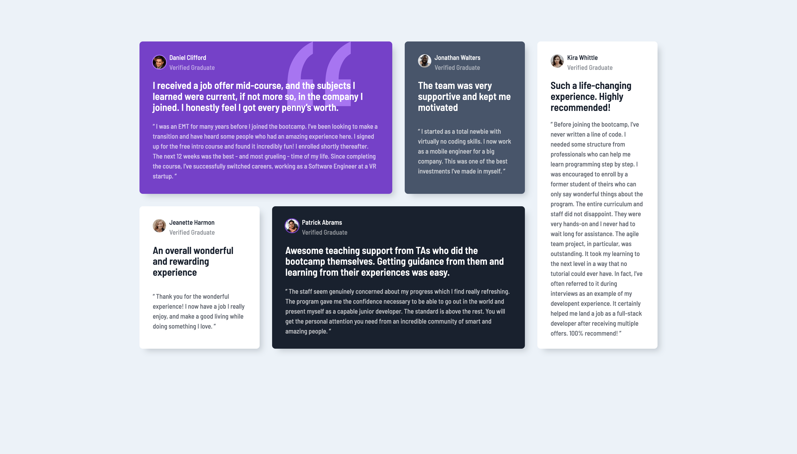

# Frontend Mentor - Testimonials grid section solution

This is a solution to the [Testimonials grid section challenge on Frontend Mentor](https://www.frontendmentor.io/challenges/testimonials-grid-section-Nnw6J7Un7). Frontend Mentor challenges help you improve your coding skills by building realistic projects.

## Table of contents

- [Overview](#overview)
  - [The challenge](#the-challenge)
  - [Screenshot](#screenshot)
  - [Links](#links)
- [My process](#my-process)
  - [Built with](#built-with)
  - [What I learned](#what-i-learned)
  - [Continued development](#continued-development)
  - [Useful resources](#useful-resources)

## Overview

### The challenge

Users should be able to:

- View the optimal layout for the site depending on their device's screen size

### Screenshot

### Links

- Live Site URL: [Vercel](https://fementor-testimonials-grid.vercel.app/)

## My process

### Built with

- Semantic HTML5 markup
- CSS custom properties
- CSS Grid
- Mobile-first workflow

### What I learned

A lot about custom properties, especially using them outside of `:root`. Also a lot about CSS Grid and a more modular, generalised CSS methodology, taking inspiration from CUBE CSS.

### Continued development

Definitely more to learn about Grid! Also, I'd like to continue to work in a CUBE CSS methodology and refine my understanding of it, especially the distinction between and best use-cases for utilities and exceptions.

### Useful resources

- [Simple CUBE CSS boilerplate](https://github.com/Set-Creative-Studio/cube-boilerplate) - This boilerplate really helped me to understand the modularity of CUBE and setting up a project.
- [Utopia](https://utopia.fyi/m) - Amazing resource for working with fluid, responsive design.
